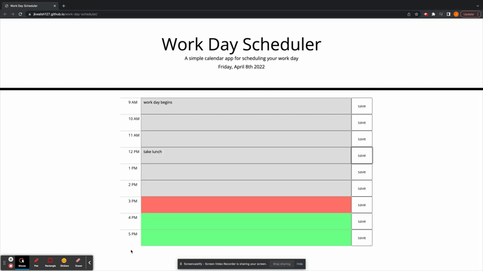

# Work Day Scheduler

## Description

This project is a web app designed to be a daily planner. I used jQuery to import the current time of day, which is updated by the second using JavaScript. JavaScript is also used to color-coordinate the hours based on the time of day, and also to save user inputs on local storage so that they can be rendered upon page load. The script is set up to render the functions every second, so that the hourly forms are colored according to the time of day, without having to reload the page.

### Workflow

1. Hardcode 9 sections of form inputs in the HTML document to represent each hour of the business day, giving unique ids to each
2. Set the timer in the .js doc and append the day's date to a subheading on the html document
3. use the timer to extract the current hour, comparing this value to the data-hour value of each section to set the section elements with unique classes based on the time of day
4. The user will enter tasks for the hour in text areas, which will to be saved to local stoarge when their corresponding save buttons are clicked
5. Render the data from local storage on a seconds basis

---

### App demonstration

---

#### Usage

Click <a href="https://jkwalsh127.github.io/work-day-scheduler/" target="_blank">**here**</a> to check out the deployed planner!

#### Credits

Staff at UC Berkeley Extension full-stack coding bootcamp

